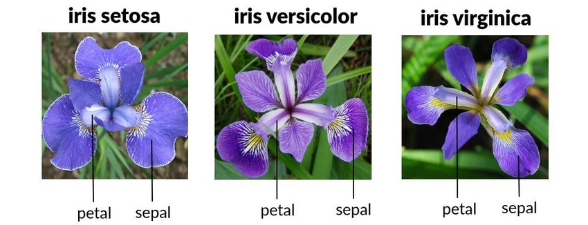

# K-Means Clustering on Iris Dataset: An Analysis


This repository contains an in-depth analysis of the Iris dataset using the K-Means clustering algorithm. The primary objective of this project is to evaluate the performance of the K-Means algorithm with varying numbers of clusters (k=2, k=3, and k=4). The results are assessed using a variety of metrics.

## Project Overview



The [Iris dataset](https://scikit-learn.org/stable/auto_examples/datasets/plot_iris_dataset.html) is a multivariate dataset introduced by the British statistician and biologist Ronald Fisher. It consists of 50 samples from each of three species of Iris flowers. Four features were measured from each sample: the lengths and the widths of the sepals and petals.

src: [The Iris Dataset](https://scikit-learn.org/stable/auto_examples/datasets/plot_iris_dataset.html)

For more details, read more on the Wikipedia page: [Iris flower data set](https://en.wikipedia.org/wiki/Iris_flower_data_set)

In this project, I try to apply the K-Means clustering algorithm to this dataset and evaluate its performance with different numbers of clusters.

## Results

The table below provides a summary of the results obtained from the K-Means clustering algorithm for different numbers of clusters:
| Number of Clusters (k) | Elbow Method Score | Silhouette Score | ARI Score | NMI Score |
|------------------------|--------------------|------------------|-----------|-----------|
| 2 | 152.35 | 0.68 | 0.54 | 0.66 |
| 3 | 78.85 | 0.55 | 0.71 | 0.74 |
| 4 | 57.23 | 0.50 | 0.61 | 0.70 |

## Detailed Analysis

- **Elbow Method Score**: The score exhibits a significant drop from k=2 to k=3, indicating a clear distinction between clusters at k=3. Beyond k=3, the score plateaus, suggesting no substantial benefit in increasing the number of clusters.
- **Silhouette Score**: The score for k=3 (0.55) is slightly lower than for k=2 (0.68). However, this doesn't necessarily imply that k=2 is superior. Silhouette scores can be influenced by data distribution and cluster shapes.
- **Adjusted Rand Index (ARI)** and **Normalised Mutual Information (NMI)**: These metrics reach their peak at k=3, with ARI=0.71 and NMI=0.74. These metrics measure the agreement between the k-means clustering and the actual labels, indicating a strong match with the three known clusters.

## Conclusion

Despite the slightly lower Silhouette score for k=3, the significant drop in the Elbow Method score and the highest ARI and NMI values at k=3 provide compelling evidence that three clusters is the optimal choice. While the Silhouette score is higher for k=2, other evaluation metrics (Elbow Method, ARI, and NMI) favor k=3. This aligns with the known ground truth of the Iris dataset, which consists of three distinct flower species.

## Future Work

Further research could explore the application of other clustering algorithms to the Iris dataset and compare their performance with the K-Means algorithm. Additionally, the impact of data normalization and feature selection on the clustering results could be investigated.

## References

[Iris-UCL_Machine_Learning_Repository](https://archive.ics.uci.edu/dataset/53/iris.data)

[The Iris Dataset](https://scikit-learn.org/stable/auto_examples/datasets/plot_iris_dataset.html)

[Data_Clustering_with_K-Means](https://towardsdatascience.com/data-clustering-with-k-means-3b8d8b2b4e3f)

[K-Means_Clustering_of_Iris_Dataset](https://www.kaggle.com/code/khotijahs1/k-means-clustering-of-iris-dataset)

[Silhoutte_Score](https://blog.csdn.net/qq_45759229/article/details/124855867)

[Adjusted_Rand_Index](https://scikit-learn.org/stable/modules/generated/sklearn.metrics.adjusted_rand_score.html)

[Normalized_Mutual_Information](https://scikit-learn.org/stable/modules/generated/sklearn.metrics.normalized_mutual_info_score.html)

```py
print("Thank you for reading!")
```

## Thank you for reading!

If you have any questions or feedback, feel free to reach out to me on [LinkedIn](https://www.linkedin.com/in/stefansphtr/).

[](#k-means-clustering-on-iris-dataset-an-analysis)


